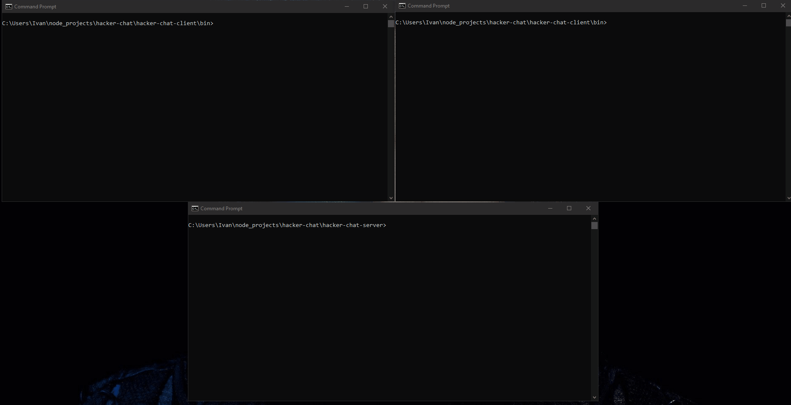

# hacker-chat

Chat console app made with Node.js and socket.io. The goal of this example app is to demonstrate the ease of use of Socket.io with Node.js. 



## Functionality

User execute script and starts chat with other users. User can create chat room or join to existing ones. Then, user choose username and
start to chat with other people in selected room.

## Getting Started

Navigate to folders `hacker-chat-client` and `hacker-chat-server` and execute:

```
npm install
```

When all dependencies are installed, move to `hacker-chat-server` and run chat server with following command:

```
npm run dev
```

 Create single client by navigating from another terminal to `hacker-chat-client\bin` directory and executing:
 
 ```
node .
```

## Built With

| dependency       | part            |
| -------------    |:-------------:  |
| express          | server          |
| socket.io        | server          |
| chalk            | server & client |
| commander        | client          |
| inquirer         | client          |
| socket.io-client | client          |
